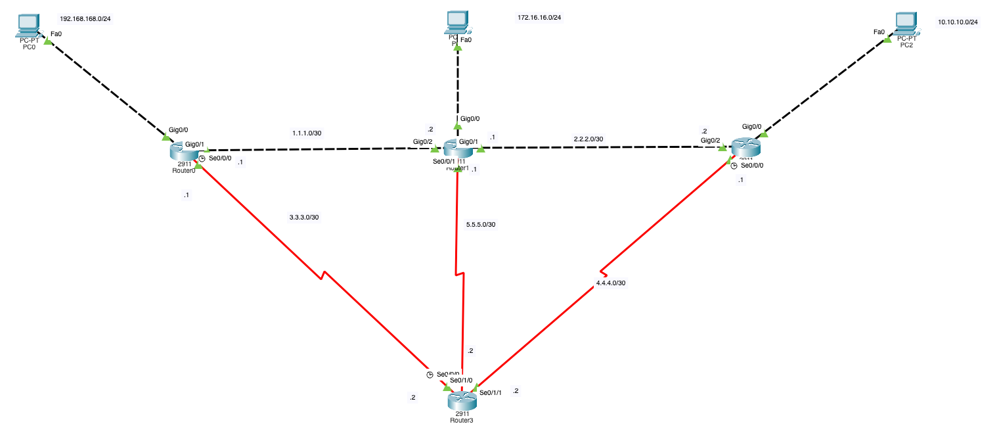

# Static route configuration assignment

## Initial setup
We will work with the following network topology:

There will be 3 PCs and 4 routers. The goal is tho configure static routes on the routers so that the PCs can communicate with each other while being in different networks.
For the serial lines, the routes will have higher administrative distance than the direct routes, so that the direct routes are preferred, but if the direct route is down, the serial route will be used.

## Configure the PCs
- Open the PC, enter its IP configuration and fill in local network parameters
- Do not forget to set the default gateway to the router's IP address

This is an example for the PC0. **Fill in the details for other PCs** similar to this example, with their proper IP addresses.

## Router configuration

### Router 0
- Open the CLI console for the router
- Deny the default configuration using `no`
- Go to the en environment: `en`
- Enter global configuration mode: `conf t`
- Disable DNS lookups: `no ip domain-lookup`
- Set the hostname to "Router-1": `hostname R0`
- Start with interface `Gig0/0` connected to the PC0 - `interface g0/0`
- Assign the IPv4 address using `ip address 192.168.168.1 255.255.255.0`. This is the default gateway address for the `192.168.168.0 /24` network.
- Enable the interface: `no shutdown`
- That is all for the configuration of comms with the PC0
- Now we will configure the connection to the R1 router - `interface g0/1`
- Assign the IPv4 address using `ip address 1.1.1.1 255.255.255.252`. Remember that this network connecting those two routers is using `/30` mask.
- Enable the interface: `no shutdown`
- Configure the serial interface `s0/0/0` going to the R4 router - `interface s0/0/0`
- Assign the IPv4 address using `ip address 3.3.3.1 255.255.255.252`.
- Enable the interface: `no shutdown`
- Since this is a serial DCE connection, we need to set the clock rate. Use `clock rate 128000` to set the clock rate to 128 kbps.
- Exit the interface configuration mode: `exit`

We are now done with the basic setup. **Repeat the steps for the other 3 routers.** If you are not sure how, please, refer to previous tutorials.

## Static route configuration

### Router 0
- Go to the global configuration mode: `conf t`
- Add the static route to the `172.16.16.0 /24` network - `ip route 172.16.16.0 255.255.255.0 1.1.1.2`. This router is now able to send data to the 172.16.16.0 network. But stay alert! We still need to configure the R1 router to be able to receive responses from the network, as the R1 router does not know how to send data back to the R0 router. How were the numbers in the `ip route` command calculated? **The first number is the network address, the second number is the subnet mask, and the third number is the next hop address.** The next hop address is the address of the router that is directly connected to the network we want to reach.
- Add a backup route using the R4 router - `ip route 172.16.16.0 255.255.255.0 3.3.3.2 5`. The `5` at the end is the administrative distance. The lower the number, the higher the priority. The default administrative distance for static routes is 1, so we need to set it higher than that. This way, the direct route will be preferred over the serial route, but if the direct route is down, the serial route will be used.
- Add the static route to the `10.10.10.0 /24` network - `ip route 10.10.10.0 255.255.255.0 1.1.1.2`.
- Add a backup route using the R4 router - `ip route 10.10.10.0 255.255.255.0 3.3.3.2 5`.
- Exit the global configuration mode: `exit`

### Router 1
- Go to the global configuration mode: `conf t`
- Add the static route to the `192.168.168.0 /24` network - `ip route 192.168.168.0 255.255.255.0 1.1.1.1`.
- Add a backup route using the R4 router - `ip route 192.168.168.1 255.255.255.0 5.5.5.2 5`.
- Add the static route to the `10.10.10.0 /24` network - `ip route 10.10.10.0 255.255.255.0 2.2.2.2`.
- Add a backup route using the R4 router - `ip route 10.10.10.0 255.255.255.0 5.5.5.2 5`.
- Exit the global configuration mode: `exit`

### Router 2
- Go to the global configuration mode: `conf t`
- Add the static route to the `172.16.16.0 /24` network - `ip route 172.16.16.0 255.255.255.0 2.2.2.1`.
- Add a backup route using the R4 router - `ip route 172.16.16.0 255.255.255.0 4.4.4.2 5`.
- Add the static route to the `192.168.168.0 /24` network - `ip route 192.168.168.0 255.255.255.0 2.2.2.1`.
- Add a backup route using the R4 router - `ip route 192.168.168.1 255.255.255.0 4.4.4.2 5`.
- Exit the global configuration mode: `exit`

### Router 3
- Go to the global configuration mode: `conf t`
- Add the static route to the `192.168.168.0 /24` network - `ip route 192.168.168.0 255.255.255.0 3.3.3.1`.
- Add the static route to the `172.16.16.0 /24` network - `ip route 172.16.16.0 255.255.255.0 5.5.5.1`.
- Add the static route to the `10.10.10.0 /24` network - `ip route 10.10.10.0 255.255.255.0 4.4.4.1`.

We are done! All PCs should be able to ping any other PC in the network. It may take a few tries for the ARP tables to update, so be patient.

## Testing
You can also try to disconnect any of the routes and see if the backup route is used. You can also try to change the administrative distance of the backup route to see if the primary route is used again. This is a good way to test if the configuration is correct.

### Final PKT File
[static_routes.pkt](./pkt_files/static_routes.pkt)